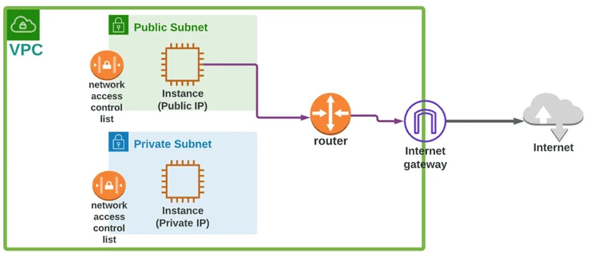
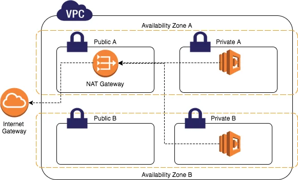
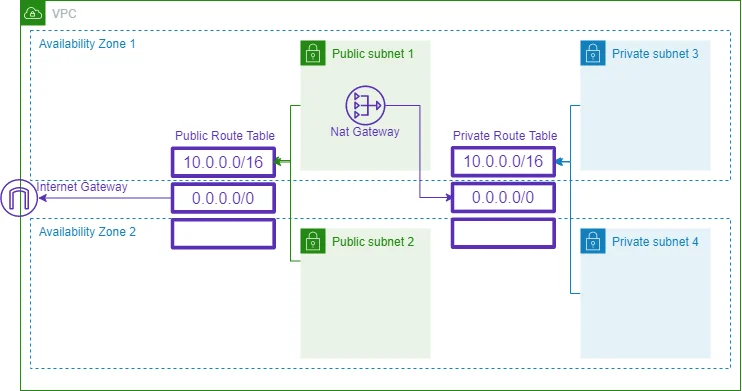

# Deep Dive into Subnets

Subnets allow for effective IP address distribution. These are segments of a larger network that often reside within a private network. You can manage IP address ranges more easily by dividing them up into smaller, easier-to-manage blocks.

Subnets are restricted to one Availability Zone. You can protect your applications from single Availability Zone failure by launching AWS resources in different Availability Zones.

# Subnet Types
When configuring your subnet’s routing, the type of subnet you end up with will depend on your choices. For instance:

When creating subnets in your VPC, it’s crucial to consider their internet connectivity.

- A `public subnet` enables resources to access the internet directly via an internet gateway.
- A `private subnet` requires a NAT device for internet access.
- A `VPN-only subnet` has a route to a Site-to-Site VPN connection, but no access to the internet gateway.
- An `isolated subnet` has no external connectivity and can only be reached within the VPC.

# Subnet Routing
Each subnet is associated with a route table that specifies allowed outbound traffic routes. All subnets are initially associated with the VPC’s main route table, but you can change this association and the contents of the main route table.

